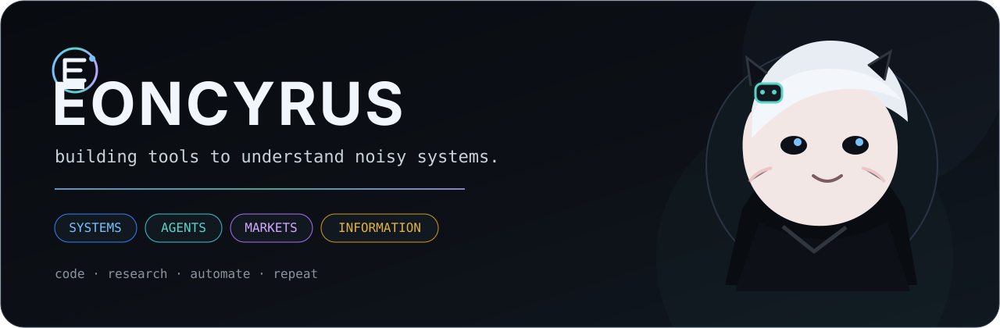
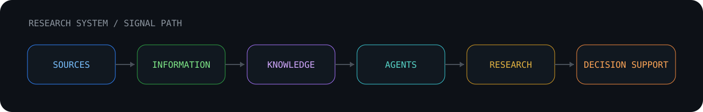
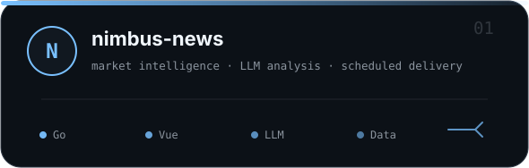
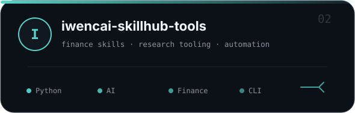
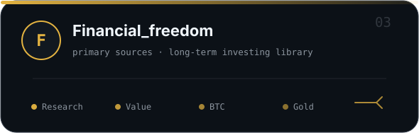
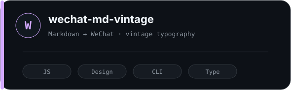
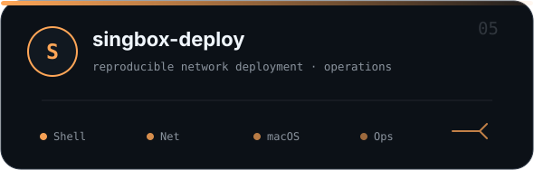
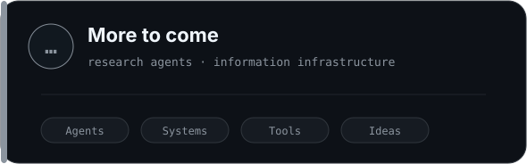
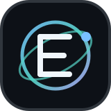

<!-- profile: eoncyrus-lab -->

<picture>
  <source media="(prefers-color-scheme: dark)" srcset="./assets/hero-character.svg">
  <source media="(prefers-color-scheme: light)" srcset="./assets/hero-character-light.svg">
  
</picture>

  <b>Independent systems builder.</b> 
  AI agents · market intelligence · developer tooling · information workflows

  <code>primary sources</code> · <code>reproducible workflows</code> · <code>decision support</code>

 

  <picture>
    <source media="(prefers-color-scheme: dark)" srcset="./assets/flow-dark.svg">
    <source media="(prefers-color-scheme: light)" srcset="./assets/flow-light.svg">
    
  </picture>

## Selected work

<table>
<tr>
<td width="50%" valign="top">
<a href="https://github.com/eoncyrus-lab/nimbus-news">
<picture>
  <source media="(prefers-color-scheme: dark)" srcset="./assets/card-nimbus.svg">
  <source media="(prefers-color-scheme: light)" srcset="./assets/card-nimbus-light.svg">
  
</picture>
</a>
</td>
<td width="50%" valign="top">
<a href="https://github.com/eoncyrus-lab/iwencai-skillhub-tools">
<picture>
  <source media="(prefers-color-scheme: dark)" srcset="./assets/card-iwencai.svg">
  <source media="(prefers-color-scheme: light)" srcset="./assets/card-iwencai-light.svg">
  
</picture>
</a>
</td>
</tr>
<tr>
<td width="50%" valign="top">
<a href="https://github.com/eoncyrus-lab/Financial_freedom">
<picture>
  <source media="(prefers-color-scheme: dark)" srcset="./assets/card-finance.svg">
  <source media="(prefers-color-scheme: light)" srcset="./assets/card-finance-light.svg">
  
</picture>
</a>
</td>
<td width="50%" valign="top">
<a href="https://github.com/eoncyrus-lab/wechat-md-vintage">
<picture>
  <source media="(prefers-color-scheme: dark)" srcset="./assets/card-vintage.svg">
  <source media="(prefers-color-scheme: light)" srcset="./assets/card-vintage-light.svg">
  
</picture>
</a>
</td>
</tr>
<tr>
<td width="50%" valign="top">
<a href="https://github.com/eoncyrus-lab/singbox-deploy">
<picture>
  <source media="(prefers-color-scheme: dark)" srcset="./assets/card-singbox.svg">
  <source media="(prefers-color-scheme: light)" srcset="./assets/card-singbox-light.svg">
  
</picture>
</a>
</td>
<td width="50%" valign="top">
<picture>
  <source media="(prefers-color-scheme: dark)" srcset="./assets/card-more.svg">
  <source media="(prefers-color-scheme: light)" srcset="./assets/card-more-light.svg">
  
</picture>
</td>
</tr>
</table>

## Principles

| Signal over noise | Systems over rituals | Long-term compounding |
|---|---|---|
| Better inputs, explicit assumptions, traceable sources. | If a workflow repeats, it should eventually become tooling. | Code, knowledge, and judgment all compound. |

<b>Toolbox / current interests</b>

 

**Build** · `Go` · `Python` · `JavaScript` · `Shell` · `Docker`  
**Agents** · coding agents · research agents · reusable skills · tool orchestration  
**Markets** · market intelligence · investment research · data pipelines · cross-market signals  
**Information** · aggregation · filtering · primary-source verification · knowledge systems

 

  <picture>
    <source media="(prefers-color-scheme: dark)" srcset="./assets/eoncyrus-mark.svg">
    <source media="(prefers-color-scheme: light)" srcset="./assets/eoncyrus-mark-light.svg">
    
  </picture>
   
  <code>code · research · automate · repeat</code>
   
  <i>Make tools for things I don't want to do twice.</i>

