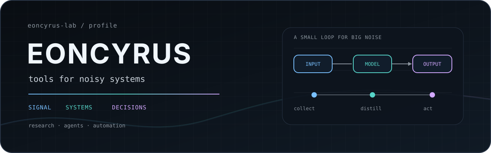

<!-- profile: eoncyrus-lab -->

  <picture>
    <source media="(prefers-color-scheme: dark)" srcset="./assets/hero-dark.svg">
    <source media="(prefers-color-scheme: light)" srcset="./assets/hero-light.svg">
    
  </picture>

<table>
<tr>
<td width="68%" valign="top">

<h3>Independent systems builder</h3>

I build practical systems around <b>AI agents</b>, <b>market intelligence</b>,
<b>developer tooling</b>, and <b>information workflows</b>.

Most of my projects start with the same question:
 
<code>Can this become a system instead of another repeated task?</code>

<kbd>AI systems</kbd>
<kbd>Agents</kbd>
<kbd>Market intelligence</kbd>
<kbd>Research infra</kbd>
<kbd>Developer tools</kbd>

Primary sources over summaries · reproducible workflows over manual rituals ·
decision support over automated decisions.

</td>
<td width="32%" align="center" valign="middle">

 
<code>build · research · automate · repeat</code>

</td>
</tr>
</table>

 

  <picture>
    <source media="(prefers-color-scheme: dark)" srcset="./assets/flow-dark.svg">
    <source media="(prefers-color-scheme: light)" srcset="./assets/flow-light.svg">
    
  </picture>

## Selected work

| | |
|---|---|
| **☁️ [nimbus-news](https://github.com/eoncyrus-lab/nimbus-news)** Personal market-intelligence pipeline: multi-source news, market snapshots, LLM analysis, scheduled delivery.  `Go` `Vue` `LLM` `Market Data` | **🧩 [iwencai-skillhub-tools](https://github.com/eoncyrus-lab/iwencai-skillhub-tools)** AI-oriented tooling for installing and managing finance research skills around iWenCai SkillHub.  `Python` `Shell` `Finance` `AI Skills` |
| **📚 [Financial_freedom](https://github.com/eoncyrus-lab/Financial_freedom)** Curated primary-source library spanning Buffett, Munger, Graham, Bitcoin, gold, and long-term investing.  `Primary Sources` `Investing` `Research` | **✒️ [wechat-md-vintage](https://github.com/eoncyrus-lab/wechat-md-vintage)** Local Markdown → WeChat HTML renderer with a restrained vintage typography system.  `JavaScript` `Typography` `CLI` |
| **⚙️ [singbox-deploy](https://github.com/eoncyrus-lab/singbox-deploy)** Reproducible sing-box deployment and operations tooling for macOS, with generic work-network profiles.  `Shell` `Networking` `Automation` | **⌁ More to come** Research agents, information infrastructure, and small tools built to remove repeated work.  `Systems` `Agents` `Markets` |

## What I care about

> **Signal over noise.**  
> Better inputs, explicit assumptions, and traceable sources.

> **Systems over rituals.**  
> If a useful workflow repeats, it should eventually become tooling.

> **Long-term compounding.**  
> Code, knowledge, and judgment all benefit from accumulation.

<b>Toolbox / current interests</b>

 

**Build**  
`Go` · `Python` · `JavaScript` · `Shell` · `Docker`

**Agents**  
coding agents · research agents · reusable skills · tool orchestration

**Markets**  
market intelligence · investment research · data pipelines · cross-market signals

**Information**  
aggregation · filtering · primary-source verification · knowledge systems

 

  <i>Make tools for things I don't want to do twice.</i>

