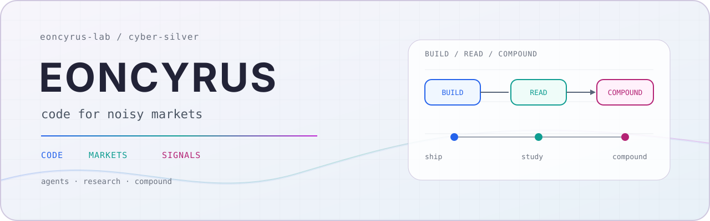

<!-- profile: eoncyrus-lab -->

  <picture>
    <source media="(prefers-color-scheme: dark)" srcset="./assets/hero-dark.svg">
    <source media="(prefers-color-scheme: light)" srcset="./assets/hero-light.svg">
    
  </picture>

  <strong>Independent systems builder.</strong> 
  I build tools that turn noisy information into repeatable decisions.

  <a href="https://github.com/eoncyrus-lab">GitHub</a>
  ·
  <a href="https://github.com/eoncyrus-lab?tab=repositories">Repositories</a>
  ·
  <code>research</code>
  ·
  <code>agents</code>
  ·
  <code>automation</code>

## What I build

I work at the intersection of research systems, agent tooling, market intelligence, and developer automation. The common thread is simple: make repeated work more traceable, useful, and difficult to do badly.

## Selected work

| Project | What it does | Stack / focus |
| --- | --- | --- |
| [Nimbus News](https://github.com/eoncyrus-lab/nimbus-news) | Multi-source market intelligence, LLM analysis, and scheduled delivery. | `Go` · `Vue` · `LLM` |
| [iWenCai SkillHub Tools](https://github.com/eoncyrus-lab/iwencai-skillhub-tools) | Reusable AI skills and batch installation tools for research workflows. | `Shell` · `AI skills` |
| [singbox-deploy](https://github.com/eoncyrus-lab/singbox-deploy) | Repeatable macOS deployment for transparent proxying and rule-based routing. | `Shell` · `macOS` · `Networking` |
| [WeChat MD Vintage](https://github.com/eoncyrus-lab/wechat-md-vintage) | Markdown-to-WeChat HTML rendering with a restrained editorial theme. | `JavaScript` · `Publishing` |

<strong>More projects</strong>

 

<a href="https://github.com/eoncyrus-lab/Financial_freedom"><strong>Financial Freedom</strong></a> · A curated library for value investing and Bitcoin research.

## Working principles

- **Signal over noise** — better inputs, explicit assumptions, traceable sources.
- **Systems over rituals** — if a workflow repeats, it should eventually become tooling.
- **Long-term compounding** — code, knowledge, and judgment compound together.

<strong>Toolbox</strong>

 

`Go` · `Python` · `JavaScript` · `Shell` · `Docker` · coding agents · research agents · reusable skills · data pipelines · knowledge systems

   
  <picture>
    <source media="(prefers-color-scheme: dark)" srcset="./assets/mark-dark.svg">
    <source media="(prefers-color-scheme: light)" srcset="./assets/mark-light.svg">
    
  </picture>
   
  <code>code · research · automate · repeat</code>

